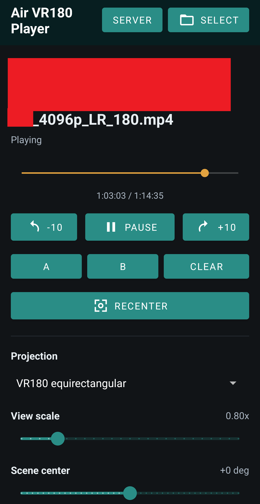

# Air VR180 Player

Air VR180 Player is a personal Android app for watching VR180 side-by-side
videos on Nreal/Xreal Air glasses.

The Android device acts as the controller and media player. The glasses are used
as the external display, and USB IMU packets from the glasses drive 3DoF head
tracking in the VR180 renderer.

The repository also includes an optional FastAPI server for browsing and
streaming a local VR180 video library over a trusted home network.



## Current Scope

This is a personal-use project, not a production app.

Supported and actively used:

- Nreal/Xreal Air glasses with USB device ID `3318:0424`
- Android USB host access
- External display presentation mode
- 3DoF IMU-driven VR180 playback
- Local file playback
- Optional local-network library browsing and streaming

## Requirements

Android app:

- Android Studio with Android Gradle Plugin 9.2.0 support
- Android SDK 36
- A compatible JDK for the Android Gradle Plugin version used here
- Android 11 / API 30 or newer
- A USB host capable Android device
- Nreal Air or compatible Xreal Air glasses
- A USB-C connection that exposes both display output and the USB HID interface

Optional video server:

- Python 3.11 or newer
- `ffmpeg` and `ffprobe` available on `PATH`
- A trusted local network between the server machine and Android device

## Build The Android App

From the repository root:

```powershell
.\gradlew.bat assembleDebug
```

On macOS or Linux:

```bash
./gradlew assembleDebug
```

The debug APK is written to:

```text
app/build/outputs/apk/debug/
```

## Configure The Optional Server

Copy the example environment file:

```powershell
Copy-Item server\.env.example server\.env
```

Edit `server/.env` for your machine:

```dotenv
API_KEY=replace-with-a-private-value
HOST=0.0.0.0
PORT=50050
SOURCES=C:\Videos\VR180;D:\MoreVr180
EXTENSIONS=.mp4,.mkv,.mov
CACHE_DIR=cache
USE_HTTPS=false
```

`SOURCES` is a semicolon-separated list of folders to scan. The server indexes
matching files, generates thumbnails with `ffmpeg`, and exposes stream URLs for
the Android app.

Install dependencies and run the server:

```powershell
py -m venv server\.venv
server\.venv\Scripts\pip install -r server\requirements.txt
server\.venv\Scripts\python server\main.py
```

In the Android app, set the server URL to the machine running the server, for
example:

```text
http://192.168.1.20:50050
```

Then set the server API key in the Android app to the same value as `API_KEY`
in `server/.env`.

## HTTP And HTTPS

Plain HTTP is the simplest option on a trusted home LAN. The Android app allows
cleartext traffic because local server IPs usually do not have public
certificates.

Do not expose the included FastAPI server directly to the internet. If you host
it outside a private LAN, put it behind a normal HTTPS reverse proxy, use a
strong API key, and restrict access at the network or proxy layer.

For local HTTPS experiments, the server can use a self-signed certificate:

```dotenv
USE_HTTPS=true
CERT_FILE=certs/dev-cert.pem
KEY_FILE=certs/dev-key.pem
```

Android will not trust that certificate by default. Debug builds can opt into
trusting self-signed server certificates through ignored `local.properties`:

```properties
airVr180.trustAllServerCerts=true
```

Leave that disabled for public or shared builds.

## Use The App

1. Connect the glasses to the Android device.
2. Install and open the app from Android Studio, or install the debug APK.
3. Grant the Android USB permission prompt.
4. Choose a local file with `Select`, or enter the server URL and open `Server`.
5. Put on the glasses and tap `Recenter`.
6. Adjust scale, scene center, and horizon if the projection needs alignment.

The phone screen remains the controller. VR video is shown on the external
glasses display when Android exposes the glasses as a presentation display.

## Project Layout

```text
app/src/main/java/com/enricoros/nreal/
  MainActivity.java              App UI, playback, external display routing
  VectorDisplayView.java         Diagnostic/vector display view

app/src/main/java/com/enricoros/nreal/player/
  Vr180Renderer.java             OpenGL ES VR180 renderer
  VrVideoSurfaceView.java        GLSurfaceView wrapper
  VrPlayerPresentation.java      External display presentation
  HeadTracker.java               3DoF tracking integration
  Quaternion.java                Rotation math
  RecentVideo*.java              Recent video persistence

app/src/main/java/com/enricoros/nreal/driver/
  NrealManager.java              USB connection lifecycle
  NrealDeviceThread.java         HID reader thread
  ImuDataRaw.java                Raw IMU packet model
  UsbUtils.java                  USB discovery helpers

server/
  main.py                        Optional local video library server
  requirements.txt               Python server dependencies
```

## Credits

Forked from https://github.com/enricoros/android-nreal

Thanks to members of the Nreal community whose early work and notes helped make
the USB/IMU side possible:

- edwatt: https://github.com/edwatt/imu-inspector
- MattXer: https://github.com/MSmithDev/AirAPI_Windows
- Noot: https://github.com/abls/imu-inspector

## License

See [LICENSE](LICENSE).
